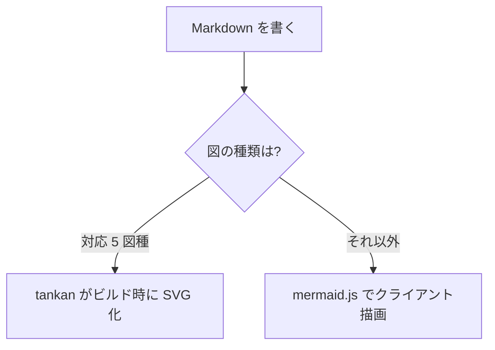
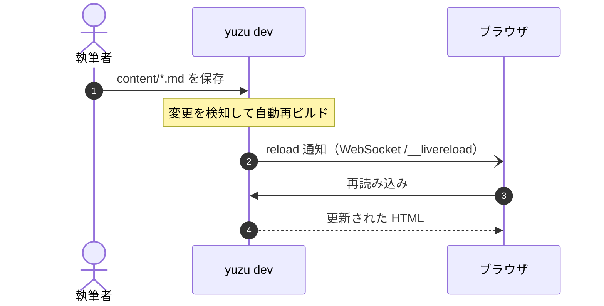
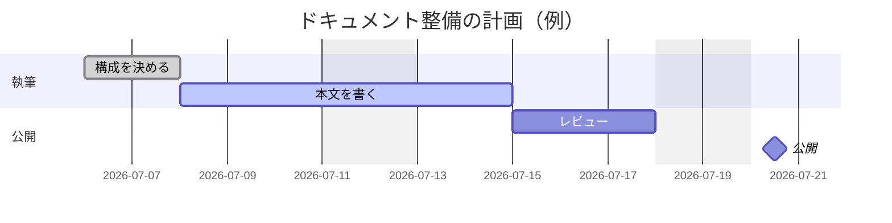
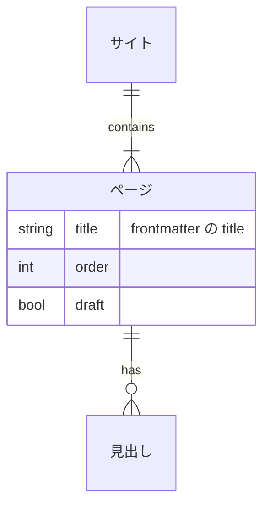

# はじめに

## ビルドする

```bash
yuzu build
```

`content/**/*.md` がテーマ HTML になり、`dist/` に出力されます。

## 開発サーバで書く

```bash
yuzu dev
```

`content/` と `theme/` を監視して自動再ビルドし、WebSocket で
ブラウザを即リロードします（執筆はこれ 1 コマンド）。
`yuzu.jsonc` の `dev.open: true` で起動時にブラウザも開きます。

WebSocket が使えない環境では `yuzu build --watch`（ポーリング式）が退避先です。

## プレビューする

```bash
yuzu preview
```

ビルド済みの `dist/` を `http://127.0.0.1:5173/` で配信します。

## frontmatter

各ページの先頭に YAML frontmatter を書けます。

```yaml
---
title: ページタイトル # ナビの表示名（未指定は h1 → ファイル名）
order: 1 # ナビの並び順（未指定はファイル名順で最後尾）
draft: true # ビルドから除外する
description: 説明 # meta description
---
```

## ナビゲーション

`content/` のディレクトリ階層がそのままサイドバーの階層になります。
並び順は `order` 昇順、未指定はファイル名順です。

### ページ内目次（TOC）

h2 / h3 見出しは右側の「目次」に自動で載ります。

### ダークモード

ヘッダー右上の ◐ ボタンで切り替えられます（`theme.dark: false` で無効化）。

## 記法サンプル

タスクリスト・引用・キーボード表記・区切り線にもテーマのスタイルが当たります。

- [ ] 未完了のタスク
- [x] 完了したタスク

> 引用ブロック。出典の明示や補足に使います。

検索ボックスへは <kbd>/</kbd> または <kbd>Cmd</kbd>+<kbd>K</kbd> でフォーカスできます。

### Admonition

`> [!NOTE]` 形式の注意書きが使えます（NOTE / TIP / IMPORTANT / WARNING / CAUTION の 5 種）。

> [!NOTE]
> 補足情報。ラベルは既定で英語です。

> [!TIP]
> 知っていると便利な使い方のヒント。

> [!IMPORTANT]
> 目的を達成するために必ず知っておくべきこと。

> [!WARNING]
> 問題を避けるために注意が必要な内容。

> [!CAUTION] 破壊的操作に注意
> `> [!CAUTION] タイトル` のように 1 行目へ書くと、ラベルを日本語などへ上書きできます。

### 脚注

本文に脚注参照を書けます[^sample]。表示では定義がページ末尾に集約され、相互リンクされます。

[^sample]:
    脚注の本文。`yuzu fmt` は定義をこの位置のまま温存します。

### 数式

インライン数式 $E = mc^2$ と、ブロック数式が書けます（同梱 KaTeX で描画）:

$$
\int_0^\infty e^{-x^2} \, dx = \frac{\sqrt{\pi}}{2}
$$

```math
a^2 + b^2 = c^2
```

`$100` のような通貨表記は数式になりません（直後に数字が来る `$` は無効）。

-----

## 図（Mermaid）

` ```mermaid ` ブロックで図が描けます。既定は同梱 mermaid.js によるクライアント描画です。

`yuzu.jsonc` で `"backend": "ssr"` にすると、**sequence・flowchart・state・
ER・gantt の 5 図種はビルド時に SVG 化**されます（JS 不要・ダークモードに即追従）。
未対応の図種は自動でクライアント描画にフォールバックし、
フォールバックが発生したページだけ mermaid.js が読み込まれます。



シーケンス図（sequenceDiagram）— `yuzu dev` のライブリロードの流れ:



ガントチャート（gantt）:



ER 図（erDiagram）:



## 全文検索

ヘッダーの検索ボックス（`/` または `Cmd/Ctrl+K` でフォーカス）から日本語で検索できます。
1 文字の誤字にも寛容です。サーバは不要で、静的ホスティングだけで動きます。

ターミナルからも同じエンジンで検索できます:

```bash
yuzu search "検索したい言葉"
```

`search.enabled: false` で機能ごと無効化できます。
