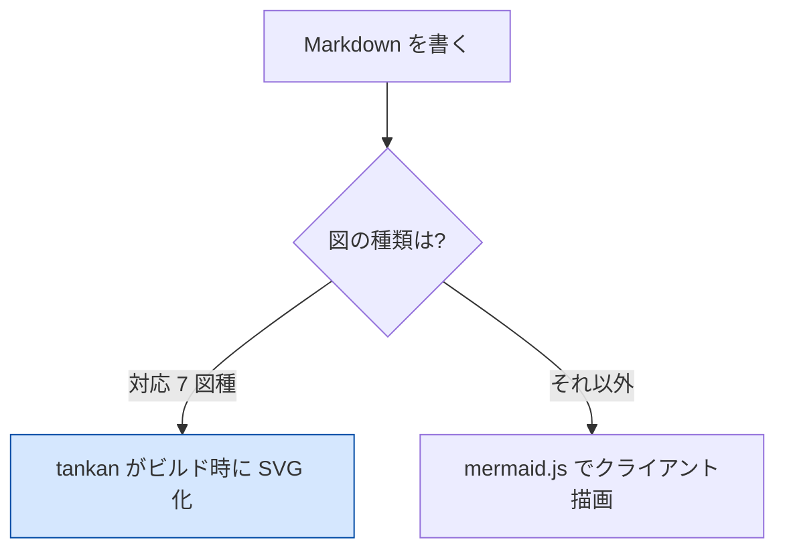
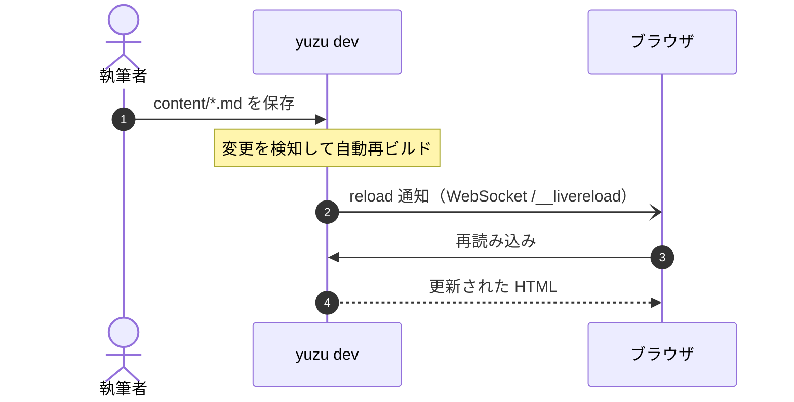
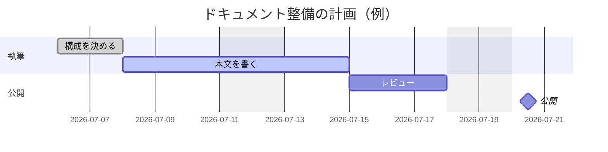
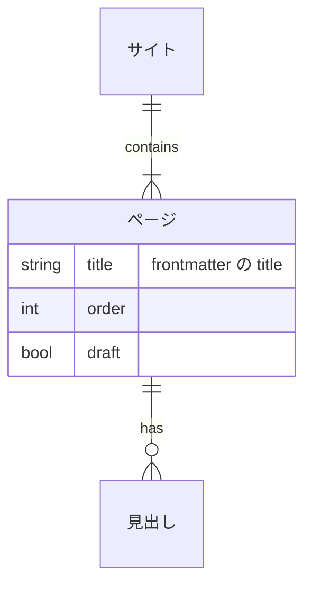
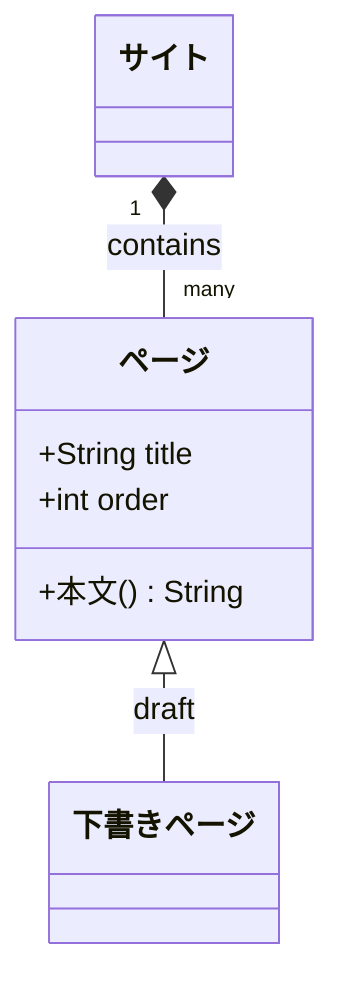
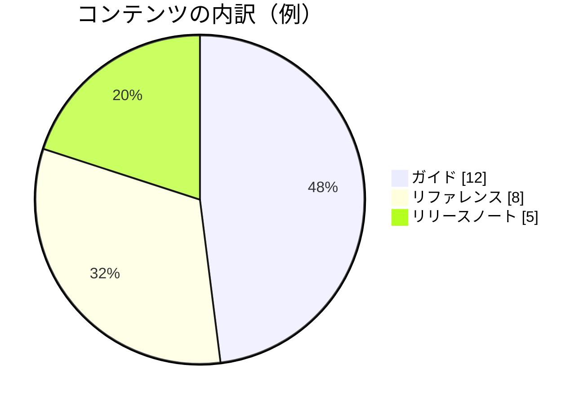

# はじめに

## ビルドする

```bash
yuzu build
```

`content/**/*.md` がテーマ HTML になり、`dist/` に出力されます。

## 開発サーバで書く

```bash
yuzu dev
```

`content/` と `theme/` を監視して自動再ビルドし、WebSocket で
ブラウザを即リロードします（執筆はこれ 1 コマンド）。
`yuzu.jsonc` の `dev.open: true` で起動時にブラウザも開きます。

WebSocket が使えない環境では `yuzu build --watch`（ポーリング式）が退避先です。

## プレビューする

```bash
yuzu preview
```

ビルド済みの `dist/` を `http://127.0.0.1:5173/` で配信します。
`--port` / `--host` で上書きできます（コンテナ内からは `--host 0.0.0.0`）。

## frontmatter

各ページの先頭に YAML frontmatter を書けます。

```yaml
---
title: ページタイトル # ナビの表示名（未指定は h1 → ファイル名）
order: 1 # ナビの並び順（未指定はファイル名順で最後尾）
draft: true # ビルドから除外する
description: 説明 # meta description
---
```

`draft: true` のページは通常ビルドから除外されますが、`yuzu dev --drafts` /
`yuzu build --drafts` で**下書きバナー付き**でプレビューできます
（通常ビルドに戻すと下書きの出力は自動で掃除されます）。

## ナビゲーション

`content/` のディレクトリ階層がそのままサイドバーの階層になります。
並び順は `order` 昇順、未指定はファイル名順です。

### ページ内目次（TOC）

h2 / h3 見出しは右側の「目次」に自動で載ります。

### ダークモード

ヘッダー右上の ◐ ボタンで切り替えられます（`theme.dark: false` で無効化）。

## 記法サンプル

タスクリスト・引用・キーボード表記・区切り線にもテーマのスタイルが当たります。

- [ ] 未完了のタスク
- [x] 完了したタスク

> 引用ブロック。出典の明示や補足に使います。

検索ボックスへは <kbd>/</kbd> または <kbd>Cmd</kbd>+<kbd>K</kbd> でフォーカスできます。

### Admonition

`> [!NOTE]` 形式の注意書きが使えます（NOTE / TIP / IMPORTANT / WARNING / CAUTION の 5 種）。

> [!NOTE]
> 補足情報。ラベルは既定で英語です。

> [!TIP]
> 知っていると便利な使い方のヒント。

> [!IMPORTANT]
> 目的を達成するために必ず知っておくべきこと。

> [!WARNING]
> 問題を避けるために注意が必要な内容。

> [!CAUTION] 破壊的操作に注意
> `> [!CAUTION] タイトル` のように 1 行目へ書くと、ラベルを日本語などへ上書きできます。

### 脚注

本文に脚注参照を書けます[^sample]。表示では定義がページ末尾に集約され、相互リンクされます。

[^sample]:
    脚注の本文。`yuzu fmt` は定義をこの位置のまま温存します。

### 数式

インライン数式 $E = mc^2$ と、ブロック数式が書けます（同梱 KaTeX で描画）:

$$
\int_0^\infty e^{-x^2} \, dx = \frac{\sqrt{\pi}}{2}
$$

```math
a^2 + b^2 = c^2
```

`$100` のような通貨表記は数式になりません（直後に数字が来る `$` は無効）。

-----

## 図（Mermaid）

` ```mermaid ` ブロックで図が描けます。既定は同梱 mermaid.js によるクライアント描画です。

`yuzu.jsonc` で `"backend": "ssr"` にすると、**sequence・flowchart・class・
state・ER・gantt・pie の 7 図種はビルド時に SVG 化**されます（JS 不要・
ダークモードに即追従）。未対応の図種は自動でクライアント描画にフォールバックし、
フォールバックが発生したページだけ mermaid.js が読み込まれます
（クライアント描画もダークモード切替に追従して再描画されます）。

flowchart・state・ER・class 図は `classDef` / `:::` / `style` などの
スタイル指定にも対応しています（`"backend": "ssr"` でもビルド時の SVG に
反映されます。指定した色はダークモードでも意図どおり固定されます）:



シーケンス図（sequenceDiagram）— `yuzu dev` のライブリロードの流れ:



ガントチャート（gantt）:



ER 図（erDiagram）:



クラス図（classDiagram）:



円グラフ（pie）:



## API 仕様（OpenAPI / JSON Schema）

` ```openapi ` / ` ```jsonschema ` ブロックに API 仕様（YAML / JSON）を書くと、
ビルド時に整形済みの HTML へ変換されます（JS 不要・ダークモードに追従）。

```jsonschema
title: 記事
type: object
required: [title, body]
properties:
  title:
    type: string
    description: 記事タイトル
  body:
    type: string
    description: 本文（Markdown）
  tags:
    type: array
    items:
      type: string
    description: タグ一覧
  status:
    type: string
    enum: [draft, published]
    description: 公開状態
```

OpenAPI 3.x / Swagger 2.0 の文書全体は ` ```openapi ` ブロックで描画できます
（info・paths・パラメータ・レスポンスを操作ごとの開閉式パネルで表示。2.0 の
`definitions` や `in: body` のリクエストボディにも対応）:

```openapi
openapi: 3.0.3
info:
  title: 記事 API
  version: 1.0.0
paths:
  /articles:
    get:
      summary: 記事一覧を取得
      parameters:
        - name: status
          in: query
          description: 公開状態で絞り込む
          schema:
            type: string
            enum: [draft, published]
      responses:
        "200":
          description: 成功
          content:
            application/json:
              schema:
                type: array
                items:
                  $ref: "#/components/schemas/Article"
    post:
      summary: 記事を作成
      requestBody:
        required: true
        content:
          application/json:
            schema:
              $ref: "#/components/schemas/Article"
      responses:
        "201":
          description: 作成成功
components:
  schemas:
    Article:
      type: object
      required: [title]
      properties:
        title:
          type: string
          description: 記事タイトル
        status:
          type: string
          enum: [draft, published]
          description: 公開状態
    ApiError:
      description: エラー応答（どの操作からも参照されないスキーマも一覧に載ります）
      type: object
      properties:
        code:
          type: integer
        message:
          type: string
```

文書末尾の「スキーマ」には `components/schemas`（2.0 は `definitions`）の
**全スキーマ**が折りたたみで並びます。上の例の `ApiError` のように、
どの操作からも参照されないスキーマもここから読めます。

ブロックの中身を `file: specs/api.yaml` の 1 行だけにすると、
**プロジェクトルート相対**の仕様ファイルを参照できます
（仕様ファイル側の変更は次のビルドで必ず反映されます）。
`$ref` はドキュメント内参照（`#/components/schemas/...` など）と
**プロジェクト内の別ファイル**（`schemas/common.yaml#/...`）を解決します。

## ページを LLM に渡す

各ページの右上にある「**Markdown をコピー**」ボタンで、そのページの
原文 Markdown をそのままクリップボードへコピーできます（LLM に貼る用途）。
同じ内容は `dist/<ページのパス>.md` としても配信され、サイト全体の索引
`llms.txt`（リンク先は各 `.md`）と全文連結 `llms-full.txt` も自動生成されます。

## 用語統一 lint

`yuzu.jsonc` の `lint.terms` に「正しい表記 → ゆれ表記」の辞書を書くと、
`yuzu lint` / `yuzu check` が本文・見出しの表記ゆれを行番号付きで報告します
（コードブロック・URL は対象外）:

```jsonc
"lint": { "terms": { "サーバー": ["サーバ"], "ユーザー": ["ユーザ"] } }
```

```bash
yuzu lint
# content/guide/api.md:12:5: warning[term-variant] 「サーバ」は「サーバー」に統一してください
```

辞書がなくても、**組み込みルール**が機械的なゆれを既定で検出します
（`lint.rules` でルール単位の無効化が可能）:

- 全角英数字（`fullwidth-alphanumeric`）: `Ｗｅｂ１２３` → `Web123` を提案
- 半角カナ（`halfwidth-kana`）: `ﾃﾞｰﾀ` → `データ` を提案
- 長音符ゆれの混在（`katakana-choon`）: プロジェクト内に `サーバ` と `サーバー` が
  混在していたら少数派の側に警告（コードブロック・URL は対象外）

## 最終更新日と編集リンク

`yuzu.jsonc` の `git` セクションを有効にすると、ページフッターに
最終コミット日と「このページを編集」リンクが出ます:

```jsonc
"git": {
  "lastUpdated": true, // 最終コミット日（git が無い環境では自動で非表示）
  "editUrl": "https://github.com/me/docs/edit/main/content/{path}"
}
```

## 全文検索

ヘッダーの検索ボックス（`/` または `Cmd/Ctrl+K` でフォーカス）から日本語で検索できます。
1 文字の誤字にも寛容です。サーバは不要で、静的ホスティングだけで動きます。

`lint.terms` の用語辞書と `search.synonyms` は検索の**クエリ拡張**にも使われます。
たとえば辞書に `"サーバー": ["サーバ"]` があれば、`サーバ` で検索しても
`サーバー` と書かれたページがヒットし、ハイライトも付きます。

`search.indexCode: true` にすると**フェンスコードブロックの中身も検索対象**になり、
関数名や設定キーで設計書を引けます（既定は off。mermaid など特別描画される
ブロックのソースは対象外です）:

```jsonc
"search": { "indexCode": true }
```

ターミナルからも同じエンジンで検索できます:

```bash
yuzu search "検索したい言葉"
```

`search.enabled: false` で機能ごと無効化できます。
