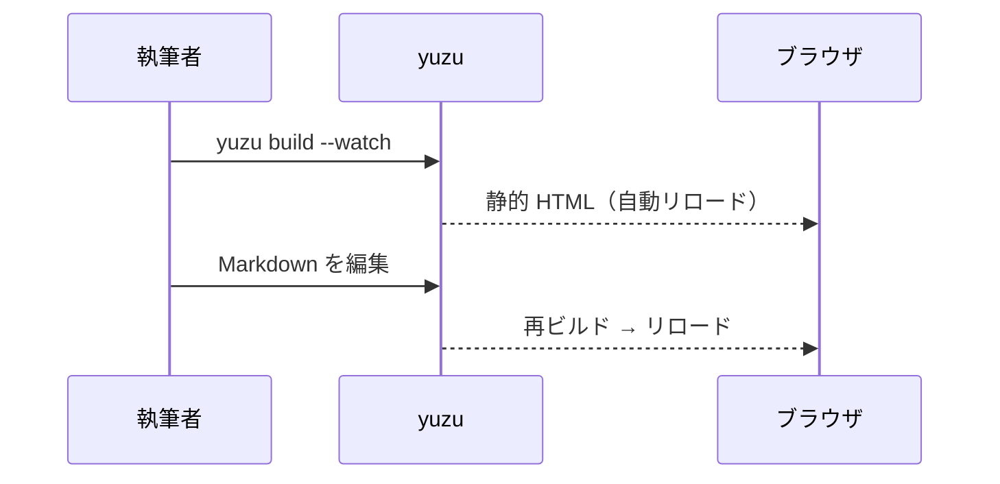

# ようこそ

これは `yuzu new` が生成したサンプルドキュメントです。
左のサイドバーでページを辿り、右の「このページ」で見出しへ飛べます。

## 機能ハイライト

| 機能 | 説明 | 状態 |
| --- | --- | --- |
| GFM の表 | この表がそれです | ✅ |
| コードハイライト | syntect（ビルド時・CSS クラス出力） | ✅ |
| Mermaid 図 | mermaid.js によるクライアント描画 | ✅ |
| 日本語全文検索 | BM25 + vaporetto + Wasm（ヘッダーの検索ボックス） | ✅ |
| llms.txt | LLM 向けの索引/全文 | Phase 4 |

## コードブロック

```rust
fn main() {
    println!("こんにちは、yuzu!");
}
```

## 図（Mermaid）



## 画像（public/ パススルー）

`public/` 以下のファイルはそのまま `dist/` にコピーされます。


---

次は[はじめに](guide/getting-started.md)へどうぞ。
