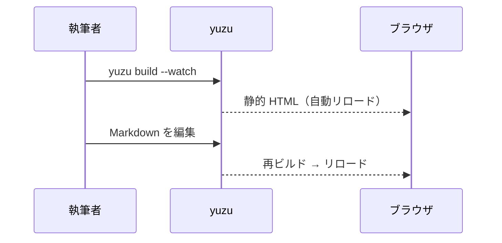

# ようこそ

これは `yuzu new` が生成したサンプルドキュメントです。
左のサイドバーでページを辿り、右の「目次」で見出しへ飛べます。

## 機能ハイライト

| 機能 | 説明 | 状態 |
| --- | --- | --- |
| GFM の表 | この表がそれです | ✅ |
| コードハイライト | syntect（ビルド時・CSS クラス出力） | ✅ |
| Mermaid 図 | クライアント描画（既定）/ `backend: "ssr"` で 5 図種をビルド時 SVG 化 | ✅ |
| 日本語全文検索 | BM25 + vaporetto + Wasm（ヘッダーの検索ボックス） | ✅ |
| llms.txt | LLM 向けの索引と全文（`/llms.txt`・`/llms-full.txt`） | ✅ |

## コードブロック

```rust
fn main() {
    println!("こんにちは、yuzu!");
}
```

## 図（Mermaid）



## 画像

`public/` 以下のファイルはそのまま `dist/` にコピーされ、`/images/...` の
サイト絶対パスで参照できます。


ページと**同じディレクトリ**（content 配下）に画像を置いて
`` のように相対パスで参照することもできます。
`.md` 以外のファイルは `dist/` へ自動コピーされ、リンクは正しい URL に
解決されます。参照切れは `yuzu check` が検出します。

-----

次は[はじめに](guide/getting-started.md)へどうぞ。
