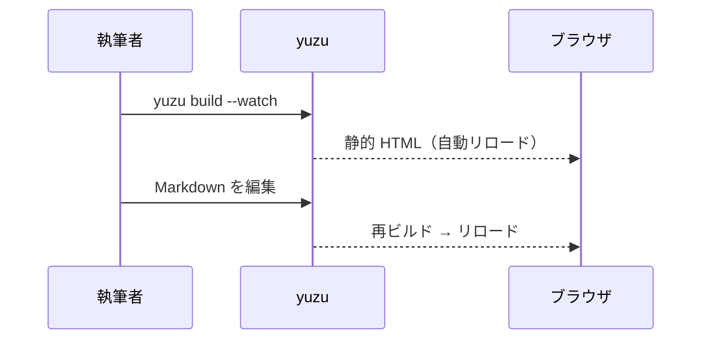

# ようこそ

これは `yuzu new` が生成したサンプルドキュメントです。
左のサイドバーでページを辿り、右の「目次」で見出しへ飛べます。

yuzu は SSG です。原稿には「SSG」と書くだけで、`yuzu.toml` の用語辞書から
ページ内の初出だけに説明（点線の下線）が付き、[用語集](glossary.md)も自動生成されます。

## 機能ハイライト

| 機能 | 説明 | このサイトでの実例 |
| --- | --- | --- |
| GFM の表 | この表がそれです | ここ |
| コードハイライト | syntect（ビルド時・CSS クラス出力） | [下](#コードブロック) |
| コードの表示メタ | キャプション・行ハイライト・行番号（JS ゼロ） | [下](#コードブロック) |
| ソースの埋め込み | `file=` で実ファイルの中身をビルド時に取り込む | [下](#コードブロック) |
| Markdown 断片の再利用 | ` ```include ` で共通の注意書きを取り込む | [下](#コードブロック) |
| タブ / コードグループ | 連続フェンスの `tab=` で切り替え表示（JS ゼロ） | [下](#コードブロック) |
| Mermaid 図 | クライアント描画（既定）/ `backend: "ssr"` で 10 図種をビルド時 SVG 化 | [下](#図mermaid) |
| 図表番号と相互参照 | `Figure:` の行で自動採番、空リンクに番号を補完 | [下](#図mermaid) |
| 折りたたみ | `> [!TIP]-` で `<details>` になる | [はじめに](guide/getting-started.md) |
| API 仕様の描画 | OpenAPI / JSON Schema をビルド時に HTML 化 | [はじめに](guide/getting-started.md) |
| 用語集と略語 | 設定の辞書から初出を `<abbr>` 化し用語集ページを自動生成 | [用語集](glossary.md) |
| 定義リスト | 用語 → 空行 → `: 説明` が `<dl>` になる | [下](#定義リスト) |
| 日本語全文検索 | BM25 + vaporetto + Wasm（ヘッダーの検索ボックス） | ヘッダー |
| llms.txt | LLM 向けの索引と全文（`/llms.txt`・`/llms-full.txt`） | `/llms.txt` |
| 品質チェック | `yuzu fmt` / `lint` / `check`（CI 用の終了コードと機械可読出力） | [はじめに](guide/getting-started.md) |

## コードブロック

```rust
fn main() {
    println!("こんにちは、yuzu!");
}
```

言語に続けて `title="..."`（キャプション）・`{2}`（行ハイライト）・
`showLineNumbers`（行番号）も書けます:

```rust title="src/main.rs" {2} showLineNumbers
fn main() {
    println!("こんにちは、yuzu!");
}
```

`file="..."` と書くと、実ファイルの中身をビルド時に読み込んで表示できます
（設計書とコードの乖離を防げます）。同梱の `snippets/greet.rs` を引用した例:

```rust file="snippets/greet.rs"
```

`lines=10-25` のように行範囲だけを切り出すこともできます。
参照先が無い・範囲外なら `yuzu check` がエラーにします。

連続するフェンスに `tab="..."` を書くと、1 つのタブグループになります
（切り替えは CSS だけで、クライアント JS は使いません）:

```sh tab="macOS / Linux"
curl -fsSL https://example.com/install.sh | sh
```

```powershell tab="Windows"
winget install example
```

素の Markdown ビューアではコードが縦に並ぶだけなので壊れません。

言語を `include` にすると、**Markdown 断片**を本文へ展開できます
（共通の注意書き・免責文の一元管理に。次の注意書きは `snippets/note.md` の実例です）:

```include file="snippets/note.md"
```

断片は散文専用です（見出し・図表キャプション・脚注は `yuzu check` がエラーにします）。

## 図（Mermaid）


```mermaid
sequenceDiagram
    participant W as 執筆者
    participant Y as yuzu
    participant B as ブラウザ
    W->>Y: yuzu build --watch
    Y-->>B: 静的 HTML（自動リロード）
    W->>Y: Markdown を編集
    Y-->>B: 再ビルド → リロード
```

Figure: ライブリロードの流れ {#fig:reload}

図・表・コードの前後に `Figure:` / `Table:` / `Listing:`（日本語の `図:` /
`表:` / `リスト:` も可）で始まる行を書くと、ページ内で自動採番された
キャプションになります。`{#fig:reload}` がラベルで、本文からは
[](#fig:reload) のように**リンクテキストを空**にすると番号が自動で入ります。

## 画像

`public/` 以下のファイルはそのまま `dist/` にコピーされ、`/images/...` の
サイト絶対パスで参照できます。


ページと**同じディレクトリ**（content 配下）に画像を置いて
`` のように相対パスで参照することもできます。
`.md` 以外のファイルは `dist/` へ自動コピーされ、リンクは正しい URL に
解決されます。参照切れは `yuzu check` が検出します。

## 定義リスト

用語の段落 → 空行 → コロン（`:`）で始まる段落を書くと定義リストになります。

SSG

: Markdown などの原稿から静的な HTML サイトを生成する仕組み。

用語をまとめて見せたいだけなら[用語集](glossary.md)の自動生成が使えます。

-----

次は[はじめに](guide/getting-started.md)へどうぞ。
