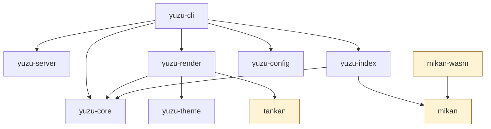

# アーキテクチャ

yuzu は Cargo workspace（MSRV 1.85 / edition 2024）で、役割ごとに
crate を分けています。

## ワークスペース構成

    crates/
    ├─ tankan       # Mermaid 互換描画（テキスト → SVG。yuzu 非依存・crates.io 公開）
    ├─ yuzu-core    # comrak パース → Document/サイトモデル（nav・TOC・slug・sourcepos）
    ├─ yuzu-render  # サイトモデル → HTML（minijinja・syntect・mermaid 変換・base path 解決）
    ├─ yuzu-config  # yuzu.jsonc（JSONC）の探索・スキーマ・解決
    ├─ yuzu-theme   # デフォルトテーマ（rust-embed: テンプレ + CSS + JS + mermaid.js）
    ├─ yuzu-cli     # CLI（bin: yuzu）
    ├─ yuzu-server  # preview/watch 用最小静的サーバ + notify 監視
    ├─ yuzu-index   # 検索インデクサ（ページ抽出・ファイル I/O・wasm 成果物の同梱）
    ├─ mikan        # 索引フォーマットと検索エンジン（native/wasm で 1 実装共有・crates.io 公開）
    └─ mikan-wasm   # クライアント検索クエリエンジン（cdylib。wasm 成果物のビルド用）

## 依存方向（凍結）

依存方向は凍結しており、逆方向の依存は作りません。図はこのサイトの
ビルド時に tankan が SVG 化したものです:

色を付けた **tankan・mikan・mikan-wasm** は yuzu の他の
crate に依存しない汎用ライブラリです。tankan（Mermaid SSR）と mikan（検索エンジン。
旧 yuzu-index-format）は [crates.io で公開](https://crates.io/crates/mikan)しており
（開発はこの monorepo で一体のまま）、書き側集約は `mikan::build`、読み側クエリエンジンは
`SearchEngine` にあり、yuzu-index はページ抽出とファイル I/O だけを担う
薄い呼び出し側です）。

## 凍結した設計判断

Web 調査込みで確定済みの技術選定です（差し替えない前提）。

| 領域 | 採用 | 要点 |
| --- | --- | --- |
| Markdown パース | comrak | GFM 完備・可変 AST・sourcepos（lint 用）・`format_commonmark`（fmt 用）。パーサは yuzu-core 内部に隠蔽し、公開 API はパーサ非依存 |
| テンプレート | minijinja | ランタイム解釈 ＝ 将来 dev でテンプレのホットリロードが可能 |
| ハイライト | syntect ＋ two-face | pure-Rust（onig 非依存）。CSS クラス出力でビルド時実行 |
| CLI | clap（derive） | 終了コード規約は 0 / 1 / 2 |
| 設定 | serde ＋ JSONC | `yuzu.jsonc` → 解決形 `.yuzu/settings.json`。上方向探索でルート確定 |
| テーマ同梱 | rust-embed | バイナリ埋め込み＋ `theme/` でファイル単位の上書き |
| dev サーバ | axum ＋ notify ＋ WebSocket | `/__livereload` への push でリロード |
| ページ並列化 | rayon | render / index のページループをデータ並列化。出力はスレッド数に依らずバイト同一 |

## tankan の設計原則

- **I/O なし・時刻 / 乱数非依存**（wasm32 対応の担保。gantt の today 線は
  意図的に描きません）
- SVG のテーマ追従は `<style>` ＋ CSS 変数方式。ユーザ指定色
  （`classDef` / `:::` / `style`）はインライン style 属性で直接埋め、
  テーマに追従させないのが正です
- `render_svg` が Err を返すと yuzu 側が自動でクライアント描画に
  フォールバックするため、**図種の追加はパーサ・レイアウトの実装に
  集中できます**

## さらに読む

- [検索の内部設計](internals-search.md) — トークナイザ整合・位置情報インデックス・OPFS
- [インクリメンタルビルドの内部設計](internals-build.md) — 3 層キャッシュキーと決定性
