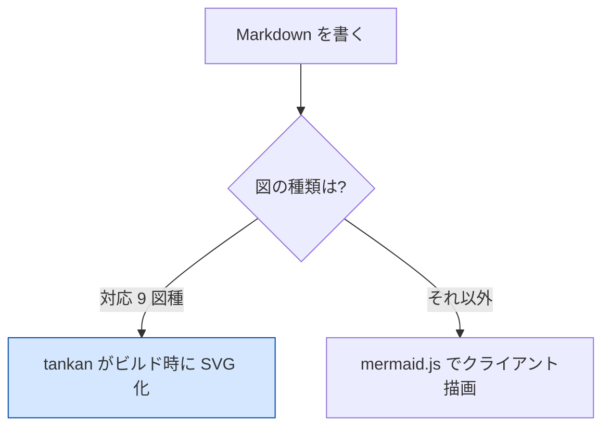
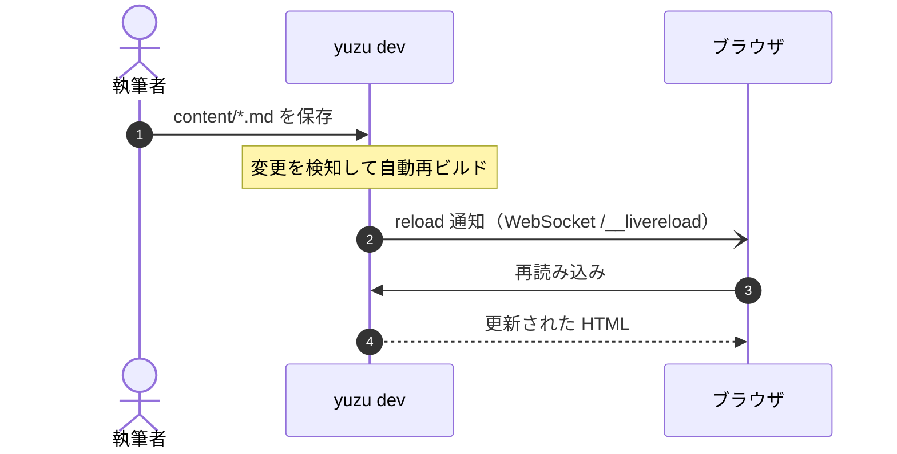
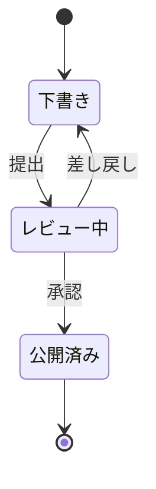
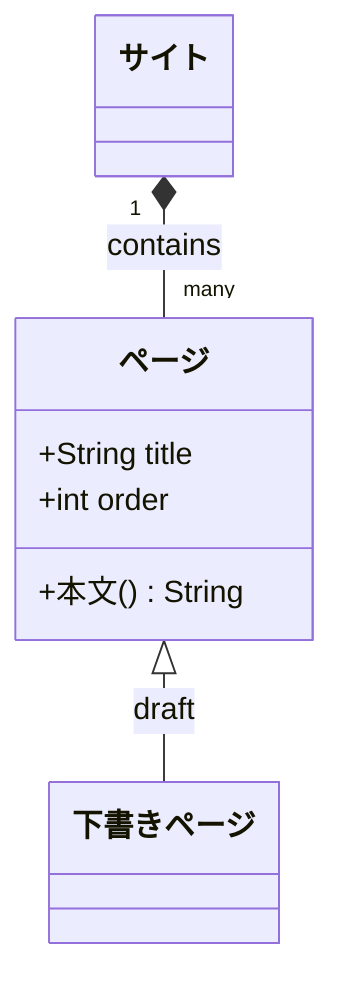
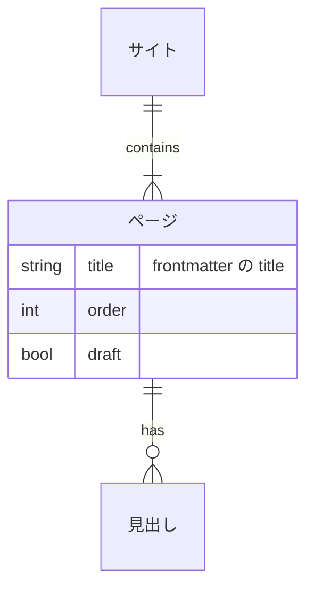
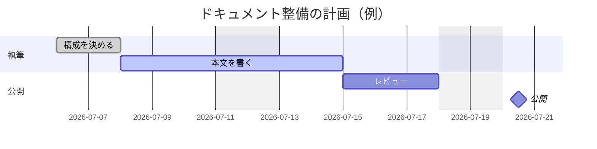
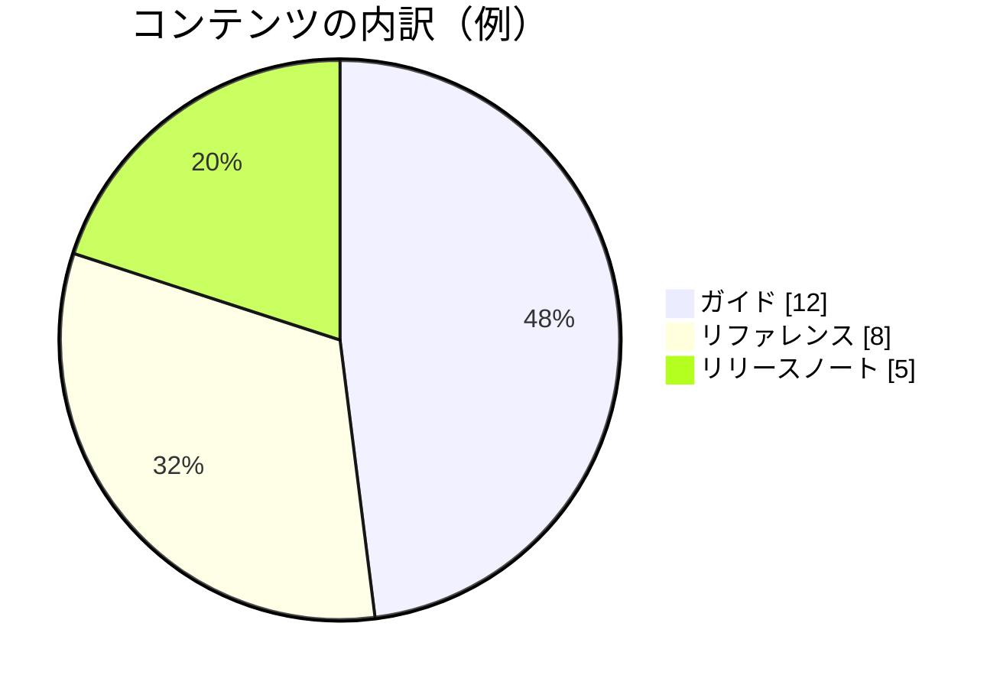
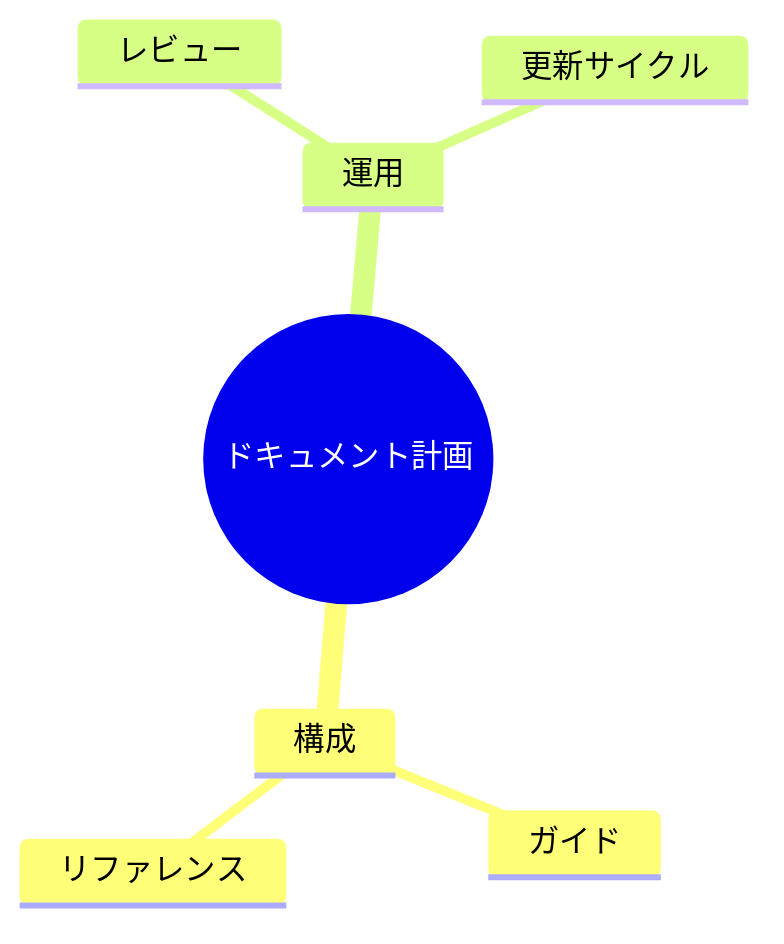
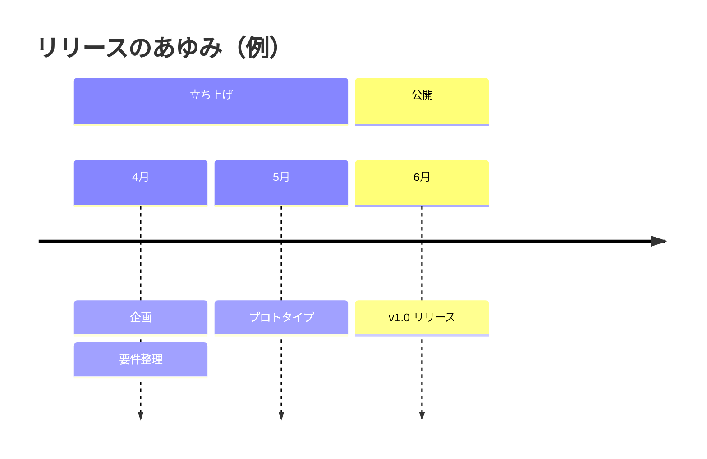

# 図（Mermaid / SSR）

` ```mermaid ` ブロックで図が描けます。描画方法は 2 つあります:

- **`backend: "client"`（既定）** — 同梱の mermaid.js がブラウザで描画します
- **`backend: "ssr"`** — Mermaid 互換の自前レンダラ **tankan** が
  **ビルド時に SVG 化**します。クライアント JS は不要で、ダークモード切替にも
  再描画なしで追従します

このサイトは `"ssr"` で運用しており、以下の図はすべてビルド時に生成された
SVG です。SSR 対応は **sequence・flowchart・class・state・ER・gantt・pie・
mindmap・timeline の 9 図種**。未対応の図種は自動でクライアント描画に
フォールバックし、フォールバックが発生したページだけ mermaid.js が
読み込まれます。

## flowchart

`classDef` / `class` / `:::` / `style` のスタイル指定も SSR に反映されます。
指定した色はダークモードでも意図どおり固定され、色付きボックスの文字色は
背景の明度から読みやすい側が自動で選ばれます。



## sequence



## state



## class



## ER



## gantt



## pie



## mindmap

インデント階層で書き、中央のルートから左右へ展開されます。



## timeline

ロードマップや沿革に向いています。



## フォールバックの挙動

SSR が扱えない図（未対応の図種や `linkStyle` / `click` などの構文）は、
エラーにせず**自動でクライアント描画へフォールバック**します。その場合も
ページ全体のビルドは成功し、mermaid.js はフォールバックが発生したページに
だけ読み込まれます。クライアント描画の図もダークモード切替を監視して
再描画されるため、見た目の追従はどちらの経路でも保たれます。

> [!TIP]
> tankan は yuzu に依存しない汎用ライブラリで、単体でも
> [crates.io で公開](https://crates.io/crates/tankan)しています
> （`cargo add tankan`。I/O なし・時刻 / 乱数非依存・wasm32 対応）。
> 設計の詳細は[アーキテクチャ](../development/index.md)を参照してください。
